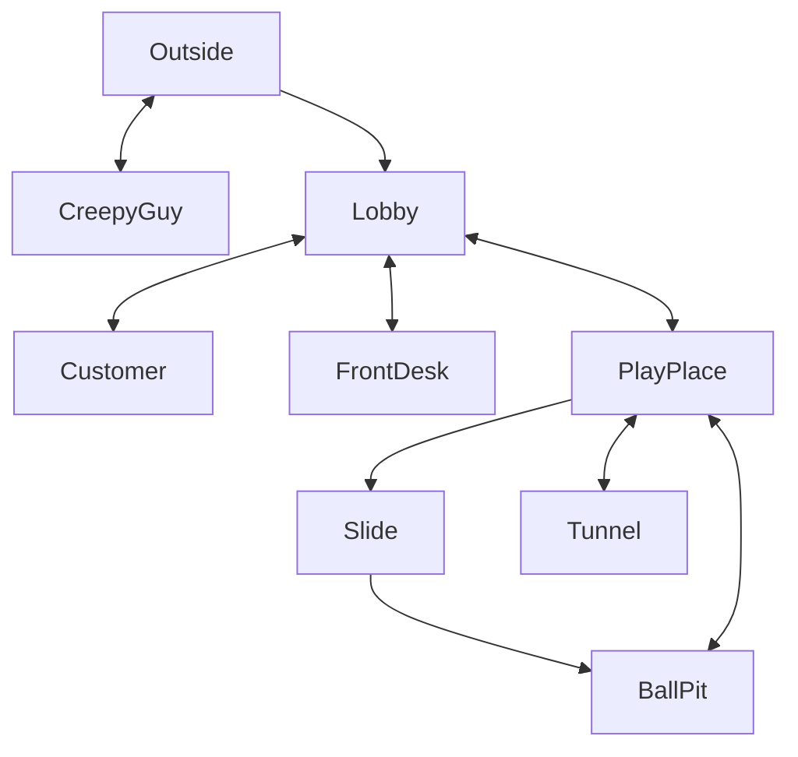

# ESCAPE FROM MCDONALDS PLAY PLACE GAME!!

## Setting

This game takes place at the Arlington Career Center. I tried to f
faithfully recreate it, with the exception of moving the 
library to the first floor.

## Map

The player starts outside, and is suppose to speak with the creepy guy outside. He asks for food so you go inside as you're feeling generous. However, there might be something in store for you inside.

## Story

You're at McDonalds, looking for a delicious lunch. You come across a man who looks somewhat shady, but honest nonetheless. He's hungry, and you decide to grab him some food. However, he doesn't have faith in your actions, and locks you inside to make sure you buy him food.

You have 15 minutes to escape the McDonalds, and if you don't he'll get Grimace to get you and you'll be trapped forever. The end goal is to acquire a McChicken, and bring it to the locked door so the homeless man lets you out.

## Global Variables

The most important variables are
`haveNote` and `haveMcChicken`, both
booleans that track progress in the
story. Depending on these two variables,
some rooms will display different things. For example, if you walk to the front desk without the note, it will prompt you to spend 1000$ on the new Big Arch that the CEO wouldn't eat. If you walk in with the note, it will show the cashier actually asking what you'd like.

I also have numeric variables called `day` and `minute` which keep track of 
time. `minute` starts at 0 and counts up
with each move.

I have a little HUD map, and use a bunch of 
boolean variables to control which
rooms the player has discovered. A map is only displayed after the user
visits it.
